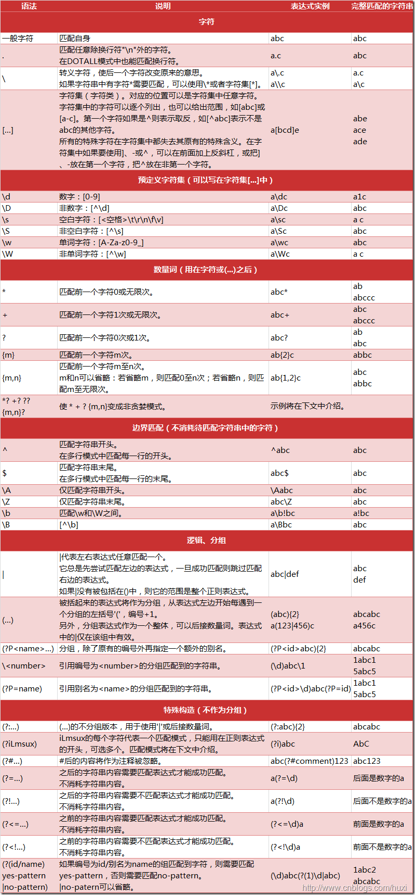
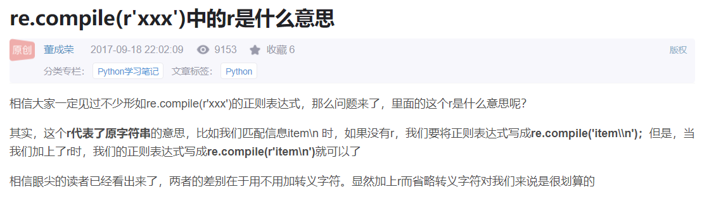

# 							提取数据学习

前言：

​		Python爬虫常用的几种数据提取方式：正则表达式、bs4、pyquery、xpath、cssselector、selenium。

​		接下来，将讲解正则、bs4以及xpath，另外两个暂不需用到。


## 一.正则表达式

​	① 概念： 用来在字符串文本中进行搜查替换等操作。


​	② 使用方式(步骤): 

​		(1) 使用**compile函数**将正则表达式的字符串**编译成一个pattern对象**

​		(2) 通过pattern对象的一些方法对文本进行匹配，匹配结果是一个**match对象**

​		(3) **用match对象的方法，对结果进行操作**


​	 ③ 常用方法：

- match：从开始位置开始查找，一次匹配，即1次匹配成功则退出
- search：从任何位置开始查找，一次匹配
- findall：全部匹配，返回列表
- finditer：全部匹配，返回迭代器
- split：分割字符串，返回列表
- sub：替换


​	④ 贪婪与非贪婪模式

- 贪婪模式：在整个表达式匹配成功的前提下，尽可能多的匹配
- 非贪婪模式：在整个表达式匹配成功的前提下，尽可能少的匹配
- python里面数量词默认是贪婪模式

例如：查找文本abbbbbbbccc，re结果是： ab*，贪婪模式结果是：abbbbbbb，非贪婪模式结果是：a


Python支持的正则表达式元字符和语法：






有关正则提取的练习：

```python
#-*- codeing = utf-8 -*-
#@Time : 2021/11/23 11:17
#@Author : 陈梓烁
#@File : re模块（正则提取）.py
#@Software：PyCharm

import re
import requests

#一、re工具：findall,在后面的东西中匹配前面的东西
result1=re.findall("a","我是一个abcdefg")
print("这个是结果1的打印效果:",result1)

result2=re.findall("a","我是一个abcdefga")
print("这个是结果2的打印效果:",result2)

result3=re.findall(r"\d+","我今年18岁，我有8945121348万元")#r是为了防止后面的“\”被转译
print("这个是结果3的打印效果:",result3)

print("---------------------------------------------------------------------------")

#二、re工具：finditer，迭代器（这个是重点，多多练习），匹配到所有的内容。
result4=re.finditer(r"\d+","我今年18岁，我有8945121348万元")
print("这个是结果4直接的打印效果:",result4)
for item in result4:
    print("这个是item的打印效果:",item)
    print("这个是item.group()的打印效果:", item.group())

print("---------------------------------------------------------------------------")

#三、re工具：search，搜索，只匹配前面的内容，只会匹配一次。
result5=re.search(r"\d+","我今年18岁，我有8945121348万元")
print(("这个是结果5直接的打印效果:",result5))
print(("这个是result5.group()直接的打印效果:",result5.group()))

print("---------------------------------------------------------------------------")

#四、re工具：match，匹配，是从字符创的开头开始匹配的，类似在正则前面加上了^,只会匹配一次结果，最前面。
result6=re.match(r"\d+","我今年18岁，我有8945121348万元")
print(result6)#使用match时，相当于变成r"^\d+",从数字开始，由于这个例子中没有从数字开始的，所以没有匹配到对象，变成NONE.

result7=re.match(r"\d+","18岁我今年，我有8945121348万元")
print("这个是结果7直接的打印效果:",result7)
print("这个是result7.group()直接的打印效果:",result7.group())

result8=re.match(r"\w+","我今年18岁，我有8945121348万元")
print("这个是结果8直接的打印效果:",result8)
print("这个是result8.group()直接的打印效果:",result8.group())

print("---------------------------------------------------------------------------")

#五、re工具：compile，预加载，提前把对象加载完毕。
obj=re.compile(r"\d+")
result9=obj.findall("我叫周杰伦，今年32岁，我的班级是78910班")
result10=obj.search("我叫周杰伦，今年32岁，我的班级是78910班")
result11=obj.match("我叫周杰伦，今年32岁，我的班级是78910班")
result12=obj.finditer("我叫周杰伦，今年32岁，我的班级是78910班")
for item in result12:
    print("这个是结果12的打印效果:", result12)
    print("这个是result12.group()的打印效果:", item.group())

print("这个是结果9的打印效果:",result9)
print("这个是结果10的打印效果:",result11)


print("---------------------------------------------------------------------------")
#五、re在网页提取中的应用:
#1.匹配
s="""
<div class="西游记"><span id='10010'>中国移动</span></div>
<div class="西游记"><span id='10086'>中国联通</span></div>
"""
obj1=re.compile(r"<span id='\d+'>.*?</span></div>")
result13=obj1.findall(s)
print("这个是结果13的打印效果:",result13)

obj2=re.compile(r"<span id='(\d+)'>(.*?)</span></div>")
result14=obj2.findall(s)
print("这个是结果14的打印效果:",result14)

obj3=re.compile(r"<span id='(?P<id>\d+)'>(?P<name>.*?)</span></div>")
result15=obj3.finditer(s)
for item in result15:
    id=item.group("id")
    print("这个是结果15的打印效果(1):",id)
    name=item.group("name")
    print("这个是结果15的打印效果(2):",name)
    hunhe = item.group("id","name")
    print("这个是结果15的打印效果(3):", hunhe)
```


### **案例：使用 re进行豆瓣250个电影的相关名称、导演、主演、出版时间、国家、类型等信息。**

```python
import requests
import re
import random

# 保存数据


#定义ip池
proxies_list=[
        {"http": "123.118.4.195:8118"},
        {"http": "180.97.87.63:80"},
        {"http": "180.97.87.63:80"},
        {"http": "119.28.155.202:9999"},
        {"http": "125.124.218.207:3128"},
        {"http": "47.100.255.35:80"},
        {"http": "112.6.117.135:8085"},
        {"http": "203.189.223.120:8888"},
        {"http": "120.220.220.95:8085"},
        {"http": "120.220.220.95:8085"},
        {"http": "106.14.42.197:8080"},
        {"http": "219.246.65.55:80"},
        {"http": "120.77.247.79:80"},
        {"http": "222.223.182.66:8000"},
        {"http": "111.43.79.98:8085"},
        {"http": "47.119.167.255:7890"},
        {"http": "122.226.57.70:8888"},
        {"http": "61.133.87.228:55443"},
        {"http": "60.217.159.157:8060"},
        {"http": "120.196.112.6:3128"},
        {"http": "118.31.7.187:8888"},
        {"http": "47.100.255.35:80"},
        {"http": "27.191.60.141:3256"},
        {"http": "120.220.220.95:8085"},
]

proxy=random.choice(proxies_list)#随机抽取一个ip
def download(url):
    headers={
        "user-agent": "Mozilla/5.0 (Windows NT 10.0; Win64; x64) AppleWebKit/537.36 (KHTML, like Gecko) Chrome/96.0.4664.45 Safari/537.36"
    }
    response=requests.get(url=url,headers=headers,proxies=proxy)
    #解决乱码问题：response.enconding="utf-8"
    pagesource=response.text
    #
    #编写正则表达式
    #re.S 可以让正则中的.匹配换行符
    obj=re.compile(r'<div class="item">.*?<span class="title">(?P<name>.*?)</span>.*?<p class="">.*?导演: (?P<daoyan>.*?)&nbsp;&nbsp;主演: (?P<zhuyan>.*?)...<br>.(?P<year>.*?)&nbsp;/&nbsp;(?P<country>.*?)&nbsp;/&nbsp;(?P<type>.*?)</p>.*?<div class="star">.*?<span>(?P<evaluate>.*?)</span>',re.S)
    #进行正则匹配
    result=obj.finditer(pagesource)
    for item in result:
        name=item.group("name")
        daoyan=item.group("daoyan")
        zhuyan=item.group("zhuyan")
        year=item.group("year").strip()#去掉字符串两端的空白
        country=item.group("country")
        type=item.group("type").strip()#去掉字符串两端的空白
        evaluate=item.group("evaluate")
        # print("电影名字",name)#拿结果
        # print("导演",daoyan)
        # print("主演",zhuyan)
        # print("年份", year)
        # print("国家", country)
        # print("类型", type)
        # print("评价人数",evaluate)
        with open("top250.csv", mode="a+", encoding="utf-8") as fp:
            fp.write(f"{name},{daoyan},{zhuyan},{year},{country},{type},{evaluate}\n")
    print("豆瓣250提取完毕.")

if __name__=="__main__":
    for i in range(0,275,25):
        url="https://movie.douban.com/top250?start="+str(i)+"&filter="
        # print(url)
        download(url)
```


## 二.Xpath


